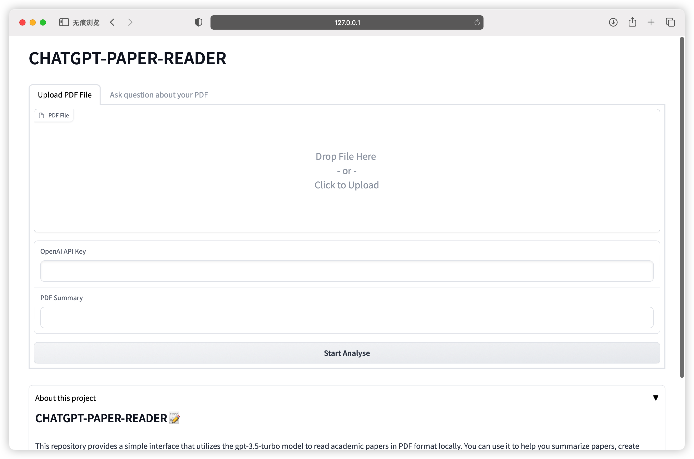
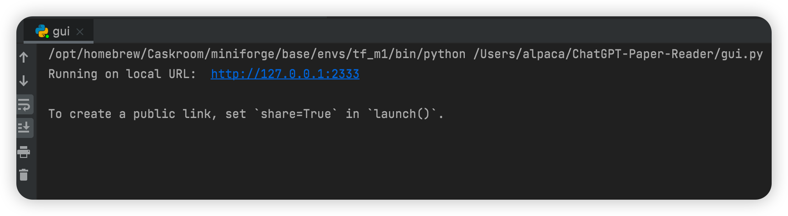

## CHATGPT-PAPER-READER

<p align="center">
  
</p>

This repository provides a simple interface that utilizes the `gpt-3.5-turbo` model to read academic papers in PDF format locally.

## Recent Updates
- Cut paper by section titles
- Support handling longer articles and produce summaries for each subsections
- Code refactorization

## How Does This Work

This repo will use ChatGPT to read complete academic papers:

- Splitting a PDF paper into multiple parts for reading and generating a summary of each part. When reading each part, it will refer to the context of the previous part within the token limit.
- Before reading the paper, you can set the questions you are interested in the prompt. This will help ChatGPT focus on the relevant information when reading and summarizing, resulting in better reading performance.
- Answer your question based on all the summaries of all parts of the paper.

By default, the initialized prompt will ask ChatGPT to focus on these points:
- Who are the authors?
- What is the process of the proposed method?
- What is the performance of the proposed method? Please note down its performance metrics.
- What are the baseline models and their performances? Please note down these baseline methods.
- What dataset did this paper use?

These questions are designed for research articles in the field of computer science. After finishing reading the paper, you can ask questions using the `question()` interface.

## Example: Read AlexNet Paper

### Summarize AlexNet
```python
import pickle
from gpt_reader.paper.paper import Paper
from gpt_reader.pdf_reader import PaperReader

reader = PaperReader(openai_key='')
paper = Paper('./alexnet.pdf')
summary = reader.summarize(paper)

# save paper & load
pickle.dump(paper, open('digested_paper.pkl', 'wb'))
paper = pickle.load(open('digested_paper.pkl', 'rb'))
# print summary of a section
print(paper.paper_summaries[4])
```

```
# console print
Beep....Beep....Beep.... Parsing
Beep....Beep....Beep.... I am reading
100%|██████████| 16/16 [02:20<00:00,  8.78s/it]
Bzzzt-klonk... Reading Done, I have built memories for this paper.
```

> reply: ('3 The Architecture\n', "Summary:\nThe authors present the architecture of their network, which contains eight learned layers, including five convolutional and three fully-connected layers. They describe some novel or unusual features of their network's architecture, sorted according to their estimation of their importance.")
  ...


### Ask some questions

```python
session.question(paper, 'Authors of this paper?')
```

> reply: The authors of this paper are Alex Krizhevsky, Ilya Sutskever, and Geoffrey E. Hinton from the University of Toronto.


```python
session.question(paper, 'Describe the proposed method in details.')
```

> reply：The proposed method is based on a large, deep convolutional neural network that is trained with stochastic gradient descent using techniques like weight decay, momentum, and dropout for regularization.  The network consists of eight layers (five convolutional and three fully-connected) with the output layer consisting of a 1000-way softmax to produce a distribution over 1000 class labels.  The authors used a ReLU activation function and local response normalization to improve training speed, and overlapping pooling to improve generalization.  They also reduced overfitting by augmenting the training data with techniques like image translations, horizontal reflections, and altering the intensities of the RGB channels in training images using PCA.  The proposed method was trained on subsets of the ImageNet dataset used in the ILSVRC-2010 and ILSVRC-2012 competitions, which contain roughly 1.2 million training images, 50,000 validation images, and 150,000 testing images. By using a large, deep convolutional neural network with various optimization strategies, the proposed method achieved top-5 error rates of 16.4% and 15.3% on the ILSVRC-2012 validation and test sets, respectively, outperforming the previous state-of-the-art results.
> 

```python
session.question(paper, 'What dataset does this paper use for experiment?')
```

> reply: The authors used subsets of the ImageNet dataset used in the ILSVRC-2010 and ILSVRC-2012 competitions for their experiments. These subsets contain approximately 1.2 million training images, 50,000 validation images, and 150,000 testing images.

```python
session.question(paper, 'What metrics does this paper use to evaluate the performace?')
```

> reply: The paper evaluated the performance of their proposed method using Top-1 and Top-5 error rates on the validation and test sets of the ILSVRC-2010 and ILSVRC-2012 image recognition challenges. The Top-1 error rate measures the percentage of images for which the predicted class label is not the correct label, while the Top-5 error rate measures the percentage of images for which the correct label is not among the five most probable labels predicted by the model.

```python
session.question(paper, 'Summarize this paper and your anwsers above, then translate the result into Chinese')
```
> reply: 这篇论文的作者是来自Toronto大学的Alex Krizhevsky、Ilya Sutskever和Geoffrey E. Hinton。该论文提出了一种基于卷积神经网络的深度学习方法，该方法在 ImageNet LSVRC-2010 和 ImageNet LSVRC-2012 图像识别挑战中达到了最佳结果。\n\n该方法使用了一系列技术来优化性能，包括使用ReLU激活函数和局部响应归一化等方法提高训练速度，使用重叠池化等方法提高泛化能力。为了减少过拟合，该方法还使用了数据增强技术，如图像平移、水平反射和使用PCA修改训练图像的RGB通道强度。作者在多个GPU上使用随机梯度下降进行训练，通过调整学习速率和使用权重衰减、动量和dropout等技术来优化性能。\n\n用于实验的数据集是 ImageNet LSVRC-2010 和 ImageNet LSVRC-2012 数据集的子集，其中包括大约120万个训练图像、5万个验证图像和15万个测试图像。该方法相比之前的最佳结果，达到了 更好的Top-1错误率和Top-5错误率。作者使用这两个错误率来评估性能，Top-1错误率表示预测的类别不是正确标签的百分率，而Top-5错误率表示真实标签不在模型预测的五个最可能标签中的百分率。

## GUI Interface

1. Install gradio in your python environment.
```
pip install gradio
```
2. Run gui.py. The link to the web page is output in the console.
```
python gui.py
```

3. Fill in your API_KEY in the appropriate places on the web page and upload the required analysis PDF file. After you wait for the program to finish analyzing, you can switch to the second TAB and ask the program questions about the PDF.

## TODO

- You may exceed the token limit when asking questions.
- More prompt tuning needed to let it outputs stable results.
- Imporve summary accuracies
